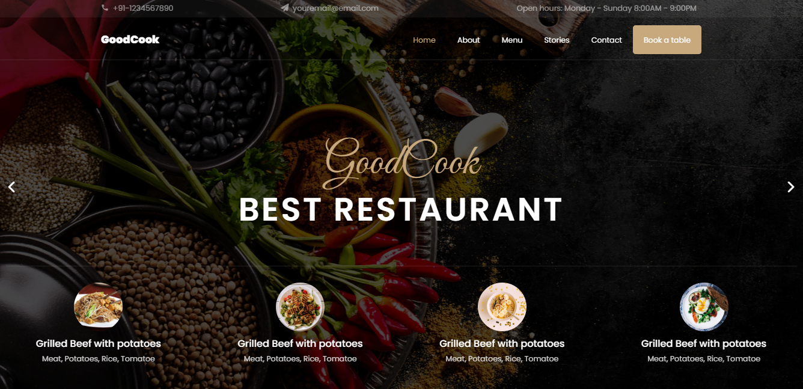
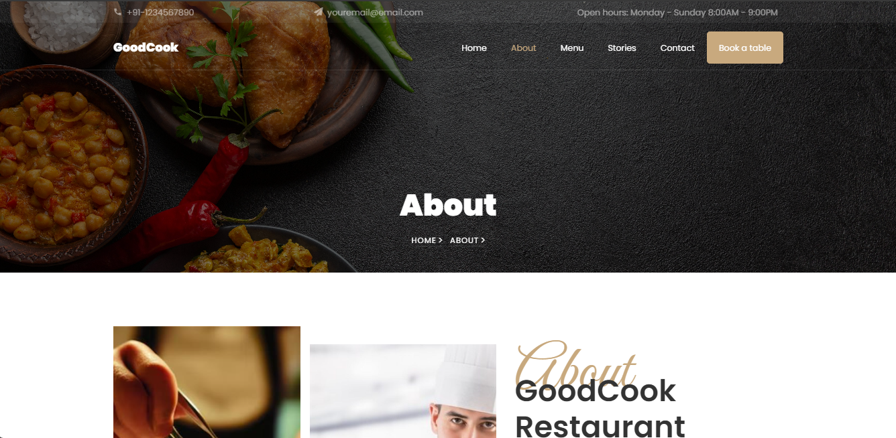
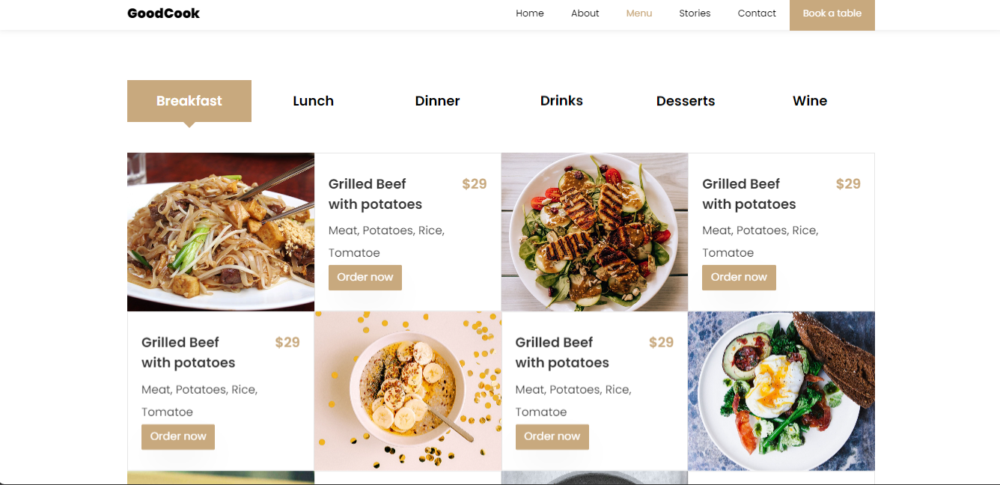

# Restaurant Website
 
## Project Overview
This project is a modern and responsive website for a restaurant, designed to provide an engaging and user-friendly experience. The website features essential sections like Home, About, Menu, Stories, and Contact to showcase the restaurant's offerings and connect with customers effectively.
 
---
 
## Features
 
### 1. Home  
- A visually appealing landing page that highlights the restaurant's theme, ambiance, and specialties.
 
### 2. About  
- Information about the restaurant's history.
- Introduces the team or chefs behind the culinary magic.
 
### 3. Menu  
- A categorized menu displaying dishes with descriptions and prices.  
- Option to highlight popular or chef-recommended items.
 
### 4. Stories  
- A section for customer reviews, testimonials, or success stories.  
- Space to share blog posts, updates, or behind-the-scenes insights.
 
### 5. Contact  
- Contact information including email, phone number, and location.  
- Integrated Google Map for easy navigation to the restaurant.  
- A functional contact form for inquiries and feedback.
 
---
 
## Technologies Used
- HTML5, CSS3, JavaScript, Bootstrap

## Website screenshots

